# AWS Certified Cloud Practitioner Certification Course (CLF-C02) Notes
### July 25

IAM(Identity and Access Management): add users, groups, policies etc (Amazon Linux 2 + t2 micro cpu are free tier)
Amazon Route 53: DNS
Amazon Resource Name (ARN) uniquely identifies AWS resources

Geographical Regions: US
Regions: US-EAST, US-WEST
Availability Zones(AZ): US-EAST-a, US-EAST-b, US-EAST-c (atleast 3 AZ for good availability)

Elastic Beanstalk: PaaS (to just host code, if set to 'highly available', automatically adds load balancing, makes more than 3 instances)
EC2: IaaS (Need to manually set up load balancers etc)

Multi-AZ: runs data in another AZ to make it highly available
Scale Up: Increase resource of a server
Scale Out: Add more servers

AWS API is HTTP/S API, use postman to send HTTPS request and talk with it
AWS API with Authorization Header and Action as payload

Cloud9 to create Virtual Env

IaC: AWS CloudFormation(CFN), AWS Cloud Development Kit(CDK)
CloudFormation stack is a template (group of resources inside)
CloudFormation - declarative, Explicit, more verbose, written in json or yaml
Cloud Development Kit - imperative, Implicit, less verbose, can be written in programming lang like py, java

Difference between CDK and SDK, is that CDK is idempotent of your infrastructure
idempotent: You can apply the same operation multiple times, and the result will be the same after the first time
CDK generates CloudFormation 'templates' (state aware) | SDK sends direct 'API calls' to AWS
CDK has state awareness
Eg: If you define an S3 bucket in CDK, and it's already created, nothing will happen on the next deploy unless you
change something
CDK uses CFN underneath
CloudFront: It is AWS Content Delivery Network (CDN) service
Caches copies of content in multiple edge locations around the world (for lower latency and faster delivery to user)

Shared Responsibility Model:
AWS: Hardware / Global infrastructure like Regions, AZ, Edge Loc, Physical Security
     Software, i.e., Compute, Storage, Database, Networking
Customer: Configuration of managed services or third party services like Platforms(OS), Applications(Prog Lang), IAM
Configuration of Virtual infrastructure and Systems like Operating Sys, Network, Firewall
Security Configuration of Data: Client-Side Data Encryption(moving from s3 to local),
Server-Side Encryption(turn on encryption on s3), Networking Traffic Protection(turn on VPC flowlogs or GuardDuty),
Customer Data(Using Amazon Macie)
Customer is responsible for Security In the Cloud, AWS is responsible for Security Of the Cloud
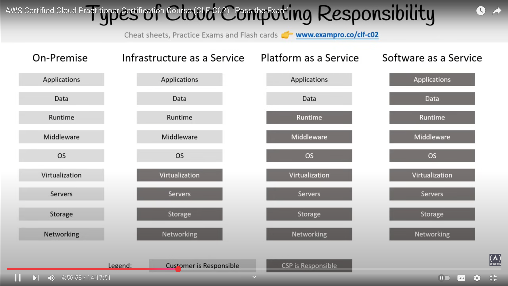

IaaS: EC2 BareMetal Instance (Customer with Hardware access, Host os config, Hypervisor, AWS with Phy Machine)
EC2 Dedicated Instance (Customer with Guest OS config, Container Runtime, AWS with Hypervisor, Phy Machine)
ECS (Customer with ability to run container apps like docker, AWS with OS, Hypervisor, Container Runtime)
*Runtime: The environment that runs your application/code

PaaS: Elastic Beanstalk (Customer can upload code, manage config of env, AWS manages servers, OS, Networking, Storage, Security)

SaaS: Amazon WorkDocs (Customer manages Content of doc, Config of sharing access controls, AWS manages OS, Servers, Networks, Storage, Security)

FaaS: AWS Lambda (Customer just uploads code, AWS manages Deployment, Container Runtime, Networking, Storage, Security)

Apart from this, there is AWS Fargate (Serverless Container as a Service)
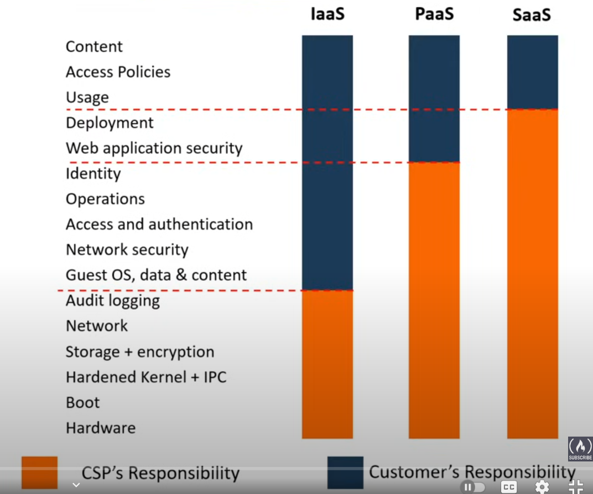
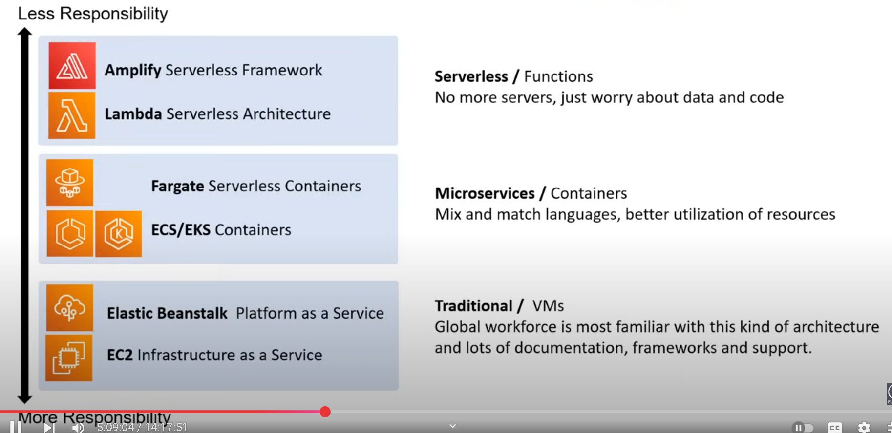

EC2 allows you to launch VM (highly configurable: cpu, ram, network bandwidth, OS(AMI), attach multiple virtual hard drives(EBS))
*AMI: Amazon Machine Image, EBS: Elastic Block Store
Lambda, S3, RDS, DynamoDB etc., also use EC2 as underlying backbone
AWS Network is the backbone for global infrastructure, EC2 is backbone for services

VM: AWS LightSail is a managed virtual server service, easy version of EC2 VM

Containers: Virtualizing an OS, to run multiple workloads on a single OS instance, used in microservice arch
ECS is a container orchestration service. Creating an ECS cluster with EC2 launch type(instead of fargate), creates an EC2 instance with the same instance type(t2 micro) specified in ECS creation process. Task definition defines the container image and required vCPU and ram. After this every task or service we run on the cluster, runs inside the EC2 instance.
ECR(Elastic Container Registry) is a repository for container images. To launch a container, you need an image(a saved copy). Repository is just a storage with version control.
ECS Fargate is a serverless container orchestration service. Same as ECS except you pay-on-demand per running container (with ECS, you have to keep a EC2 server running even if you have no containers running)
EKS(Elastic Kubernetes Service) is a fully managed Kubernetes Service. Kubernetes is an open source orchestration software. Used when you need to run Kubernetes as a Service
*Instance: A virtual env instance

Serverless: AWS Lambda: serverless functions service. Can run code without provisioning or managing servers. Charged based on runtime of the function rounded to the nearest 100ms

ECS Creation:
i. Create Cluster (Cluster is a container playground, where you can add tasks, services etc. Its like a template)
ii. Make a task definition (blueprint  that tells specific containers to run(can specify the container image), how much CPU/memory each gets)
iii. Add a task or service in the created cluster, which uses the created task definition.
Task: Run this program once
Service: Keep this program running forever, with X copies, and restart it if it crashes
Security group: virtual firewall for each cluster

The Nitro System: Combo of Dedicated Hardware and Lightweight Hypervisor
Bottlerocket: linux-based OS by AWS, for running containers on VM or bare metal hosts
HPC (High Performance Computing): Many servers with fast connection between them to increase computing capacity
HPC is for ML or very complicate scientific computing stuff
ParallelCluster: AWS-supported open source cluster management tool, for HPC clusters on AWS

Edge Computing: When you push your workloads outside of your network to run close to destination. eg: pushing computing to run on external servers, phone, iot not within your network in premise
Hybrid Computing: When you run workloads on premise and in AWS VPC
AWS S3 Outposts: Physical rack of servers that we can get and put in our own datacenter. Allows access to AWS services like EC2 within premise
AWS Wavelength: Allows to build and launch application in telecom datacenter. Ultra low latency, since they are on 5G network, closest to end user
VMWare Cloud on AWS: Allows you to manage on-premise VMs which are using VMWare for virtualization, by making them into EC2 instances
AWS Local Zones: Edge datacenters outside of AWS region. Allows compute closer to destination. When you need fast computing, storage and databases in populated areas outside AWS Regions

Cost Mangement: How to save money?
Capacity Management: How do we meet the demand of traffic and usages by adding or upgrading servers
EC2 Spot Instances (up to 90% off): Buying spare EC2 capacity for a discount, capacity can be taken back anytime if AWS needs it
EC2 Reserved Instances (up to 75% off): Reserve to use specific instance type in specific region for 1 or 3 years. Payment can be Full upfront, Partial upfront or Monthly
EC2 Savings Plan: Commit to spend a fixed amount of $ per hour on compute for 1 or 3 years. Can change region, instance (flexible)
AWS Batch: To run batch computing jobs that dont require user interaction. Can utilize Spot instances or On-Demand
AWS Compute Optimizer: ML is used to suggest how to save money and improve performance, by analyzing previous usage history
EC2 Autoscaling Groups(ASG): Automatically adds or removes EC2 capacity as per demand
ELB and EB also comes under Cost and Capacity Management

Storage: Types are Block, File, Object
(Block) EBS - Can be used by only one EC2 Instance. Manually increase storage size. Stored in only one AZ. Supports only a single write volume(One user can attach it one instance and write, others cant write at the same time). Protocol: FC, iSCSI
(File) EFS(Elatisc File System) - Can be used my many EC2 Instances at the same time. Automatically grows/shrinks as you add or remove files. Data is replicated across multiple AZ. Allows multiple reads, writes, but locks the file (Allows multiple users to read and write, but while one is writing, lock is put, so that others cant write at the same time). Protocl: SMB, NFS
(Object) S3 - Scales with no limit. Multiple read, write with no locks. Protocl: HTTP/S, API

S3 Object: They are like files
Key: name of the object, Value: data as sequence of bytes, VersionID: version of object, Metadata: additional information attached to the object
Each S3 object can be between 0 bytes and 5 terrabytes
S3 Bucket holds many objects. Each bucket must have unique name

S3 Storage Classes: Cheap to Cheapest
S3 standard(replicated across 3 AZ), S3 Intelligent Tiering(uses ml to choose best storage class), S3 Standard-IA (Infrequent Access) (Cheaper if you access files less than once a month, additional retreival fee is applied), S3 One-Zone-IA (stored in only one AZ), S3 Glacier (for long term cold storage, retrieval can take minutes to hours), S3 Glacier Deep Archive (takes 12 hours to retrieve data)
S3 Outposts dont fit in this

AWS Snow Family: It is a set of physical devices used for moving large amounts of data in and out of AWS, as well as for edge computing. It includes devices like Snowcone, Snowball, and Snowmobile(100 PB of storage per device). Date is delivered to S3

Storage Services: S3(serverles object storage, auto scaling, unlimited storage), S3 Glacier(archiving and long-term backup, uses prev gen HDD to get that low cost), EBS(persistant cloud storage, its a virtual hard drive in the cloud you attach to EC2 instances), EFS(cloud-native NFS file system, mount to multiple EC2 at same time), Storage Gateway(hybrid cloud storage, which extends on-premise storage to the cloud), AWS Snow Family(storage devices used to physically migrate large amounts of data), AWS Backup(managed backup service, centralize and automate backup of data across multiple AWS services like EC2, RDS, EBS), CloudEndure Disaster Recovery(continously replicates your machine into low cost staging area for recovery), Amazon FSx(feature rich and highly-performant file system)

S3 Config: After turning on encryption of objects in S3 Bucket. If any hacker steals hard drive from AWS, they cant decrypt our files. Can set lifecycle rule like "move all objects to glacier after 30 days". Can have upto 100 Buckets per AWS account(Can be seen in Service Quotas)

EBS is under EC2 service. Can be added when creating EC2
EFS can be set to regional or one-Zone. Can be added when creating EC2

Data Warehouse: Performs aggregation on million of rows of data, to get analytical reports. Aggregation is grouping data. They are "HOT", meaning they can return queries fast, but are only uses once or twice a day to get analytical reports. Data warehouse is built for reporting, trend analysis, and decision-making. It needs to be consume relational data on a regular basis, or else the data will become outdated for reports

Key-value database: NoSQL database, fast but lacks relationship, indexes, aggregation. Value can be represented as dictionary. This can resemble a tabular database, but not every row will have every column
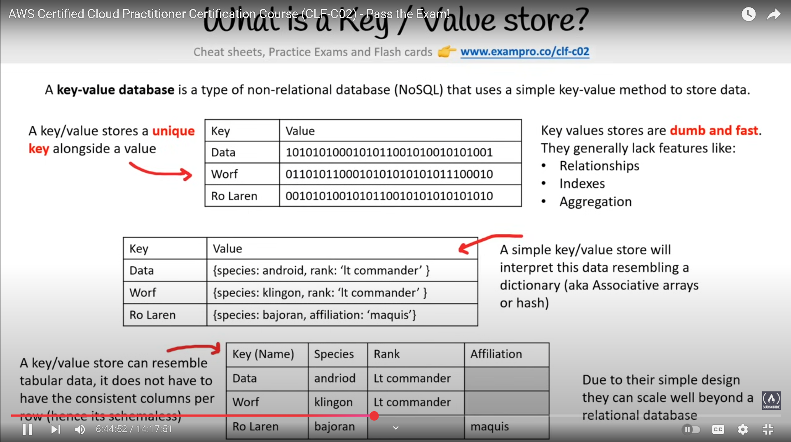

Document Store: A sub type of Key-value stores, but stores docuemnts as primary. Could be XML, but mostly it is JSON or JSON-like

Non Relational Database Services in AWS:
DynamoDB is AWSs serverless NoSQL key-value and document database. Has auto scaling, cost effective and fast (Used when we want a massively scalable database)
DocumentDB: NoSQL document database (Used when you want to use MongoDB like database)
Amazon Keyspaces: NoSQL database (When you want to use Apache Cassandra database)

Relational Database Services in AWS:
RDS: Relational Database Service. Supports several SQL engines like MySQL, MariaDB(fork of MySQL), Postgres, Oracle, MsSQL, Aurora
Aurora: Fully managed database of either MySQL or Postgres(When you need highly available, scalable, durable, secure relational db for MySQL or Postgres)
Aurora Serverless: Serverless on-demand version of Aurora(autoscaling, can pause when not in use and save money). Startup latency when resuming from pause
RDS on VMware: When you want to deploy RDS supported SQL engines on-premise. On-premise datacenter must be using VMware for server virtualization

Redshift: Data Warehouse in AWS (petabyte-size data warehouse). Datawarehouses for Online Analytical Processing(OLAP)
ElasticCache: Managed database of the in-memory and caching databases like Redis or Memcached (Improve performance of application by adding a caching layer in-front of web-server or database)
Neptune: Managed graph database. Data is represented as interconnected nodes (When you need to understand connection between data)
Amazon Timestream: Time series database. Eg. IOT devices send time sensitive information
Amazon Quantum Ledger Database: Ledger database (Transparent, immutable, cryptographically variable logs)(Used for financial information that can be trusted)
DMS(Database Migration Service): Move from on-premise to AWS, SQL to NoSQL, etc
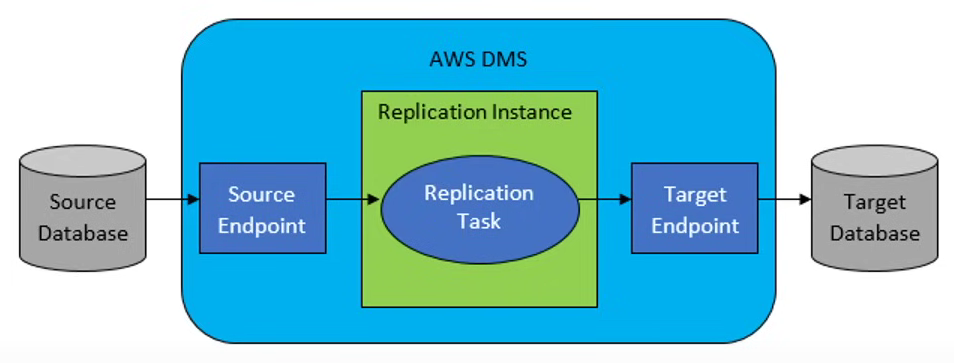
AWS Schema Conversion Tool: Used to automatically convert a source database schema to a target database schema

Cloud Native Networking Services:
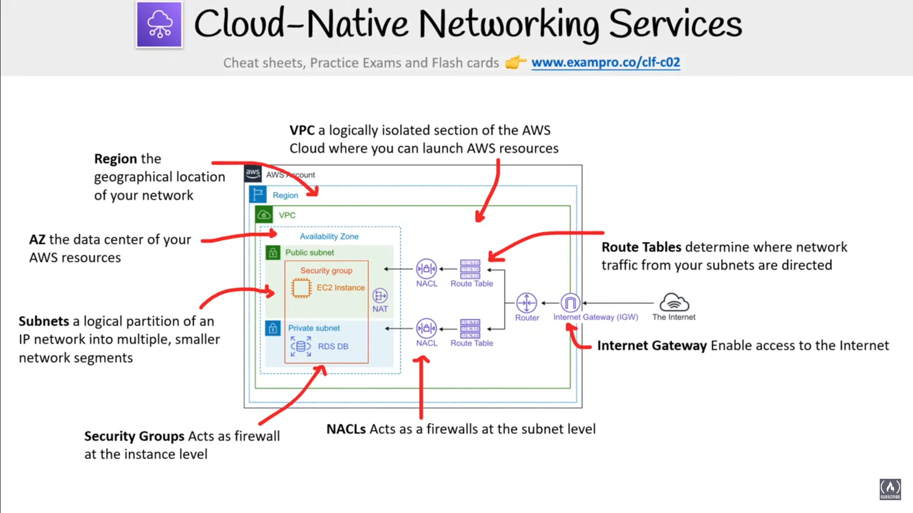

Enterprise/Hybrid Networking:
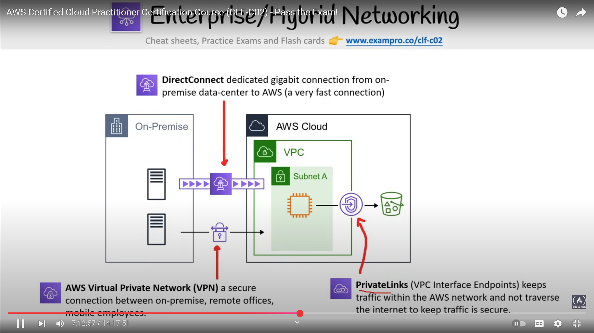

VPC and Subnets:
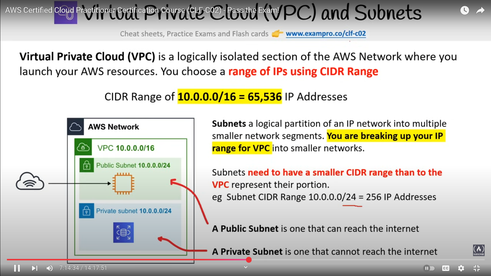

NACL(Network Access Control List) and Security Groups:
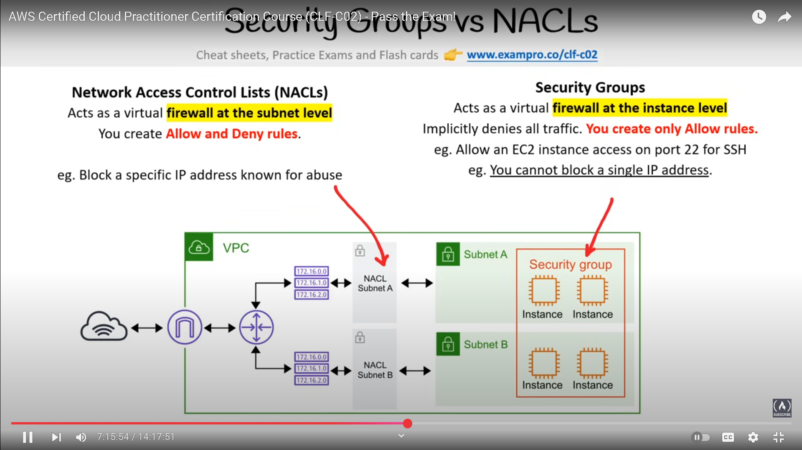

Network Config: Create a VPC with CIDR of /16, then create a subnet inside it with CIDR /24, now there is only one route in the subnet i.e to local, so create internet gateway and add it in route table with CIDR /0, now you can create an EC2 with the created VPC and subnet. You can add security groups in EC2 to allow SSH, TCP etc., You can also use NACL in VPC to block particular ip or allow connections etc., in security groups and NACL, type means to block SSH or ALL TCP connections coming from specific ip. Set rule number in NACL as multiples of 10
*Security group can allow connections to an instance, NACL allow or deny connections (block ip etc.,)

CloudFront Config: Can set origin(source of content for CDN. Eg. S3 Bucket), Can allow or block Regions, Can create invalidation(If a content in cache is stale, you can delete by entering path of it (can use wildcards '*'))

Ec2 Instance Families: Different combinations of CPU, memory, storage and network capacity. General purpose: T2, T3, Mac(Mac server), A1 etc., Compute optimized(for Scientific modelling, dedicated gaming servers, high performance processor tasks): C5, C4 etc., Memory optimized(for in-memory cache, in-memory database, real time analytics): R4, R5, X1 etc., Accelerated optimized(for ML, Hardware accelerator or co-processors): P2, P3, P4, F1 etc., Storage optimized(data warehousing, high read and write): I3, D2, D3 etc.,

Ec2 Instance Types(meaning the size and instance family): Eg. nano, micro, small, medium, large, xlarge, 2xlarge etc.,

Tenants Types:
Dedicated Hosts: Single tenant EC2 instances, physical server isolation, billed per host, can view sockets, cores, host ID(this allows to Bring-Your-Own-License(BYOL), where these informations are needed). Eg. Microsoft SQL Server needs you to enter the amount of cores etc., so we can use dedicated hosts to use the information
*It provides you the hardware transparency needed for softwares

Dedicated Instance: A single slot in a server which is shares across other customers. The slot will always be the same

Default: Your instance lives in a slot until reboot, so it changes everytime
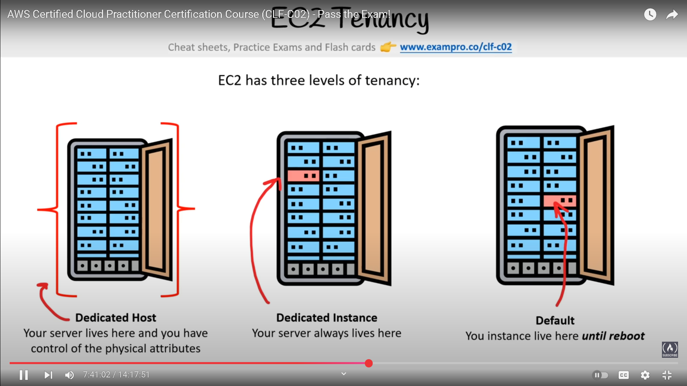

EC2 Instance Creation Config:
AWS Elastic Inference (EI) is a service that allows you to attach low-cost GPU-powered acceleration to Amazon EC2
Add SSM policy to IAM role and add it to EC2 IAM role. This allows you to securely connect to EC2 without storing SSH keys
User data: You can add commands to install and run softwares. Eg. install apache (named as httpd)
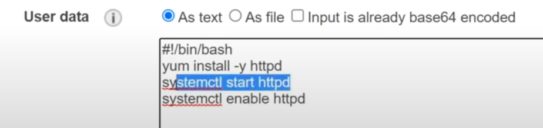
Storage: Turn on encryption
Tag: You can add a name tag to identify instance
Security group: You can use old or add new security group(Security group name cant be changed later). Add HTTP port 80 to access Apache server (source is set to anywhere, inorder to be access it from anywhere)
Launch and you can create key pair and download it(.pem file)
Search the public IPV4 address of the instance on browser, will return apache webpage
Can use CloudShell and upload the .pem private key, chmod it to 400(read only), and use it to ssh into the created EC2 instance(can use public ip or dns to ssh)
By default, we are ec2-user (name might vary for different AMI)
Apache index.html file is in /var/www/html
*Instead of ssh, you can use the SSM by clicking connect on instance. Will be logged in as ssm-user. Need to switch to ec2-user

Elastic IP address: static ip
Public IPV4 of EC2 instance wont change if it is rebooted, but will change if the instance is stopped and started
Then we can associate the elastic ip address to the EC2 instance. Now ip wont change even if stopped and started

Create AMI and launch templates: Creating an AMI is like making a copy of an EC2 instance(with its OS, config, code, data). Template is used to save EC2 launch settings (AMI, instance type, key pair, security groups, EBS settings, tags, etc.) in one reusable template.
*We can create an AMI of the EC2 with apache server and use that as the AMI for a template. Template allows us to quickly create an instance, instead of creating one from scratch. Thus, the apache server EC2 instance is saved by making it into an AMI. Future changes in the instance can be saved as AMI and updated as new version of the template

Autoscaling Group(ASG) to EC2: Add 3 AZ for availability and you can set it to scale based on different parameters like CPU utilization at 50%

Application Load Balancer(ALB): It will check the target group(list of instances). Create target group and set health check. It will check the website and if it doesnt get 200 OK signal, it will send traffic to another healthy instance. The number of times it can fail to consider the site unhealthy and the number of times it can succeed to consider the site healthy can be set. Add Load Balancer to ASG. Use DNS of load balancer to access the website instead of ip of instance. Add load balancer dns to route 53, to use load balancer when accessing website
*ASG always used together with ALB, because ALB acts as the entry point

Connecting ASG and ALB:
ASG working: ASG uses template to create the number of EC2 instances we want. If min number of instances is 1, max number of instances is 3 and desired number of instances is 2. It will launch 2 instances at the start. Each instance will have different IPV4. ASG can scale based on parameters set like CPU utilization at 50%. By default, ASG does "EC2" health check(checks if EC2 instance is running). If one instance fails, ASG terminates and creates a new one with new IPV4

ALB working: Since every instance has different IPV4, we need a common point, so we use DNS of ALB(also distributes traffic across instances). A target group should be created with health check parameters. Select the instances for target group(Or you can also add the ALB inside ASG). Add the target group to ALB. You can enable ELB health check in the ASG after adding ALB. Point route 53 to ALB dns

EC2 Pricing: On-Demand: Default EC2 pricing. Mostly charged by the second(but cost is shown as hourly), rarely by the hour. Used for short term, unpredictable experiments. After you know how much resourse it takes, you can buy reserved

Reserved Instances(RI): Used when you have a steady or predictable usage. Reduced pricing is based on Term, Class, RI Attributes and Payment options
Term: Commit to 1 or 3 year contract, when term expires, instance will be turn back to on-demand with no interruptions
Class: Standard(up to 75% lower price compared to on-demand, can modify RI attributes). Convertible(up to 54% lower price comapred to on-demand, can exchange RI based on RI attributes)
Payment options: All upfront, partial upfront, no upfront
*RIs can be shared between multiple accounts withing AWS organization. Unused RIs can be sold in Reserved Instance Marketplace

RI Attributes or Instance Attributes:
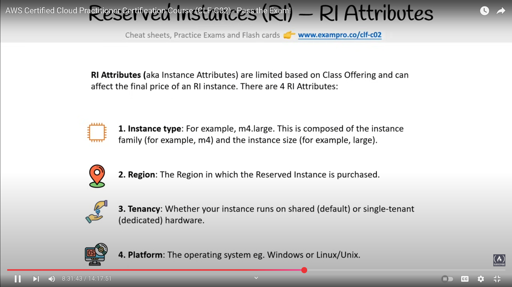

Regional and Zonal RI: Scope of the RI
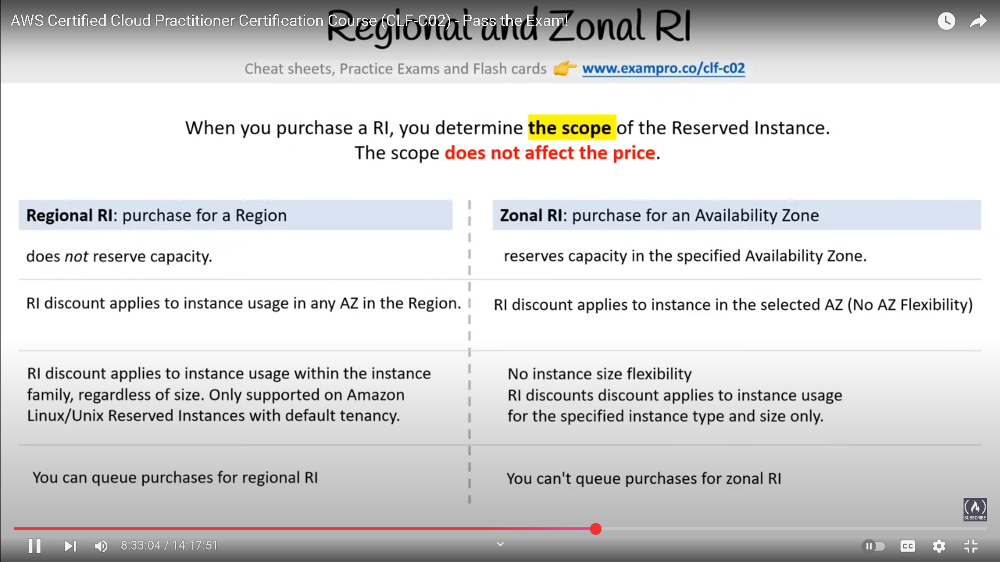

RI Limits: There is a limit to the number of RI instances you can purchase per month
20 Regional Reserved Instances per Region, 20 Zonal Reserved Instances per AZ
Regional Limits: You cannot exceed the running on-demand instance limit by purchasing Regional Reserved Instances. The limit is by 20
Zonal Limits: You can exceed the running on-demand instance limit by purchasing Zonal Reserved Instances. Eg. If you have 20 running on-demand instances and you purchase 20 Zonal Reserved Instances for an AZ, you can purchase 20 more on-demand instances for that AZ with same specification of Zonal Reserved Instances

Difference between Regional and Zonal: Purchasing Regional RI just means, you know the capacity you need in the region, so you get a discount. If you dont know the capacity you need, you can go on-demand and get no discount. Regional RI doesnt allot a slot for you in the region(Zonal RI allots slot for you in one AZ). You dont get guarantee of slot in the region, you just get discount because you know the capacity you need. Whereas, Zonal RI guarantees a slot in the specific AZ, so you can run more instances in that slot, even if the limit of 20 is reached

Capacity Reservation: Since EC2 instances are backed by hardware, they can sometimes run out of capacity to launch your new EC2 instance(only can have finite amount of servers)
By using capacity reservation, you can reserve a capacity ahead of time(AWS will remove your reserved capacity from shared instance pool and put your name on it). You will be charged on-demand instance price even if no instances are running in the reserved space

Standard RI vs Convertible RI:
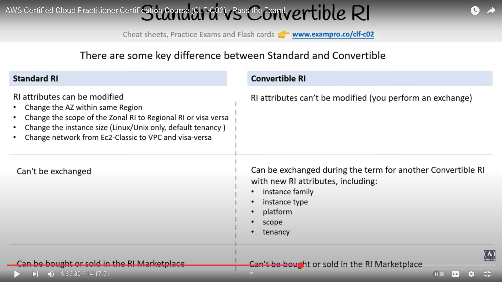

RI Marketplace:
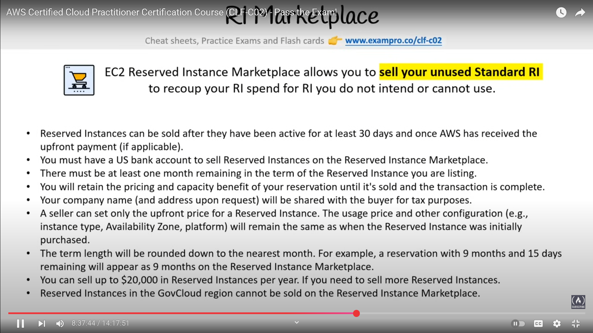

Dedicated Instances: Multi-Tenant(shared hardware with software isolation) and Single Tenant(physical isolation. Can be used for BYOL softwares)
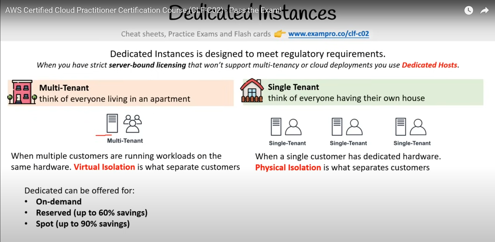

AWS Savings Plan: Similar discounts as RI but simplified purchasing process. There are 3 types of savings plan: Compute savings plan, EC2 instance savings plan, sagemaker savings plan(simpler than RI. i.e. no need to choose between standard/convertible, regional/zonal etc.)
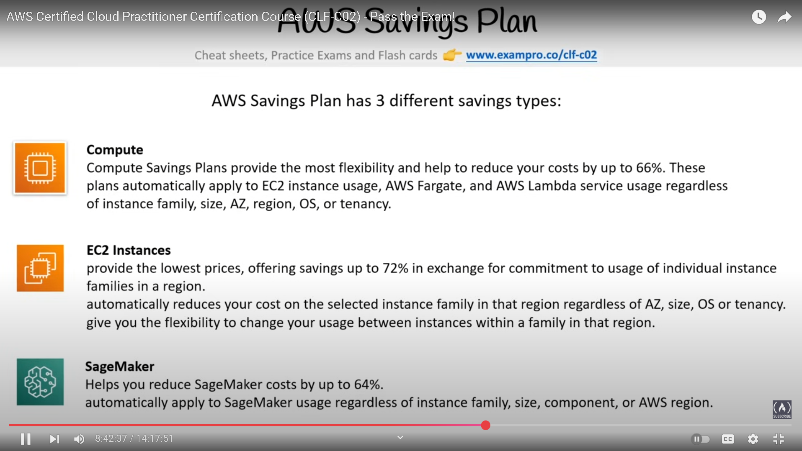
*Sagemaker is EC2 for ML(to build, train and deploy ML models)

Zero Trust Model: Trust no one, verify everything. Identity is the primary security perimeter(first line of defense) in zero trust model. Old way used Network Centric: Focused on firewalls and VPNs to secure data. Eg. data cant be accessed from locations which are outside of premise. New way uses Identity Centric: Where no matter where you are(on premise or outside premise), needs to authenticate inorder to access data(no trust given, even if on premise). Identity Centric way augments Network centric way

Zero Trust on AWS: Set up by using Identity controls, i.e. IAM. Using IAM, you can restrict users based on ip, time, region, MFA present and also set boundaries. Eventhough AWS has these options to set zero trust for users, it is manual and not intelligent ready-to-use solution. Collection of AWS services can be used to make an intelligent-ish security. Eg. AWS Cloudtrail which tracks API calls -> Amazon GuardDuty which detects suspicious activity based on cloudtrail and other logs -> Amazon Detective which can analyze and identity security issues from GuardDuty (very hard to setup)\

Third Party Solution for Zero Trust:
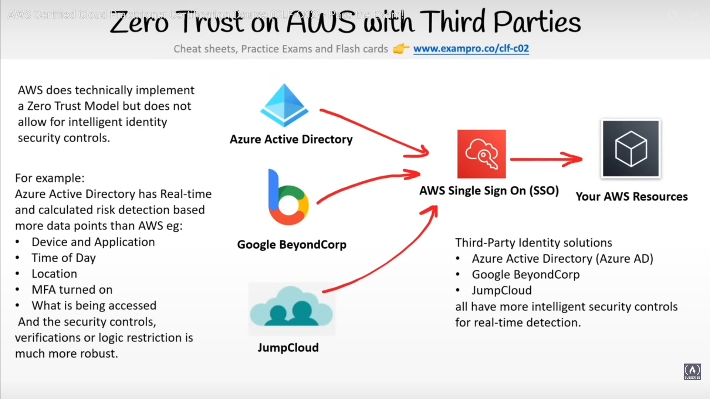

Directory Service: It maps the names of network resources to their network address
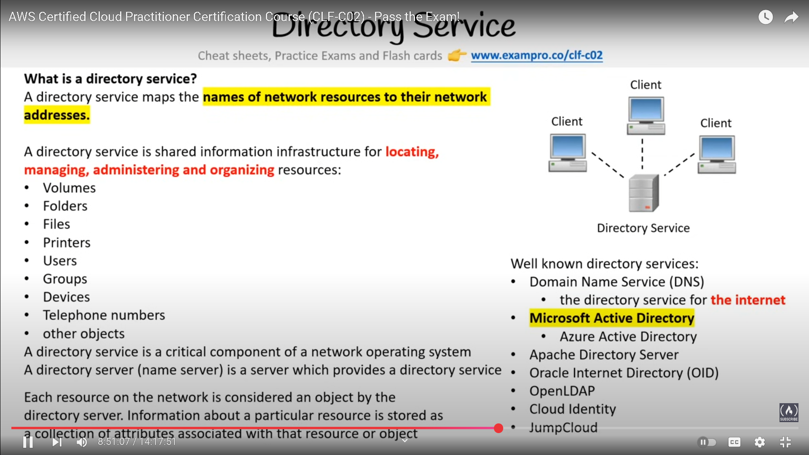

Active Directory: Access multiple infrastructure devices with one identity(each user has one identity)
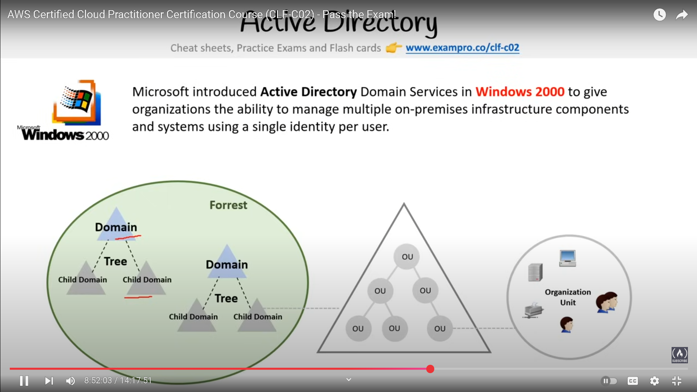

Identity Provider IdP:
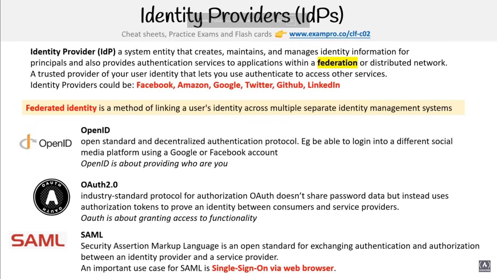

Single-Sign-On(SSO): Authentication scheme that allows a user to login to different systems with single ID and password. Login for SSO is seamless, i.e. Once a user is logged into the primary directory, they are not asked to login multiple times in different sites. Eg. If you are logged into the primary directory, you can log in to many services like aws, slack, google workspace, salesforce, devices etc. with logging into each of them

Its how a organizations computer asks user ID and password when logging into the computer and uses the same information to log you in to multiple independent services like aws, google workspace etc. The Active Directory has your user ID and the list of services you have access to like aws, google workspace etc

LDAP(lightweight Directory Access Protocol): It enables same-sign on, which allows users to use single ID and password but they have enter it every time they want to login
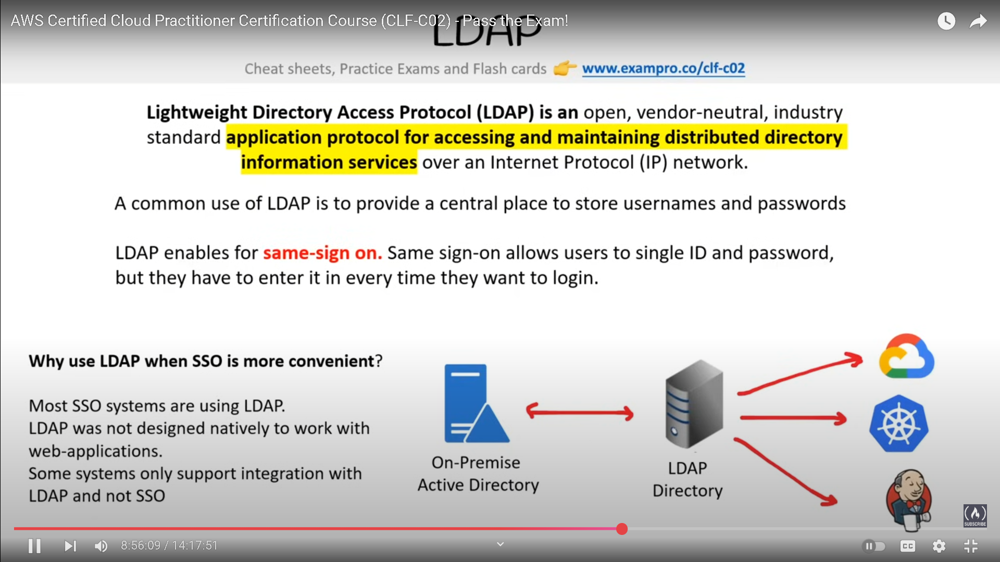

####
AWS X-Ray, AWS Partner Network (APN), AWS Global Acclerator, AWS Cost Explorer, AWS Budgets, AWS License Manager, AWS Launch Wizard (Enterprise applications that may require complex configurations and architecture), AWS Marketplace (Purchasing and deploying third-party software solutions on AWS, Streamlined billing and payment through existing AWS accounts, Curated catalog of enterprise-class software)

Policy: Rules for users, services and groups (Eg. Policy to list objects(or all actions in s3) from all or specific S3 bucket). A document (JSON) that defines what actions are allowed/denied on which resource
Roles: Create a role for services and attach the rules(policy) to it. Eg. Attach policy to list objects from specific S3 bucket to the EC2 IAM role (Now you can connect to EC2 and use commands like 'aws s3 ls' to list buckets)
*There are also inbuilt policies that you can attach to services using roles like SSM

Principal of Least Priviledge (PoLP): Just-Enough-Access(JEA): Least permissions to perform an action, Just-In-Time(JIA) Least duration to perform an action (use open-source project ConsoleMe to implement JIA)
Risk-based adaptive policies

Messaging Systems:
Queueing: It is a messaging system that generally will delete messages once they are consumed. Simple communication. No Real time
AWS Simple Queueing Service(SQS): Fully managed queueing service that enables you to decouple and scale microservices
Working: Service A does its job and passes the message in queue. Service B can pick the message later. Service A and B dont need to be running at the same time waiting for the message (Thus its decoupled)

Streaming: Its the opposite of Queueing. Here mutiple consumers(Service B, C, D getting data from Service A) can react to events(messages). Event is live in the stream for long time, so multiple operations can be applied. Real time. Costs more than queueing. Consumers read data at their own pace. Messages are stored in the stream for 24 hours. Customers can re-read messages
Amazon Kinesis:
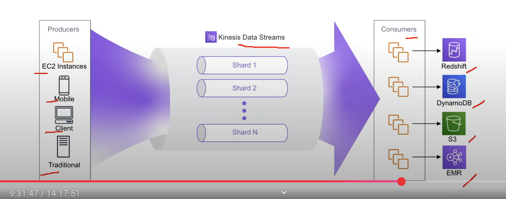

Pub/Sub: Senders (Publishers) send messages to Even Bus, Even Bus categorizes messages into groups, Receivers(Subscribers) are subscribers to those groups(Topic), and get messages delivered to them immediately. Eg. Sending message to a chat group and getting the message delivered to everyone in real time
AWS Simple Notification Service(SNS): Fully managed Pub/Sub messaging service that enables you to decouple microservices
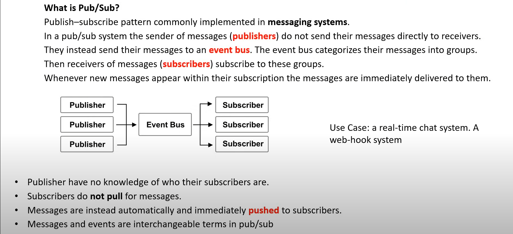
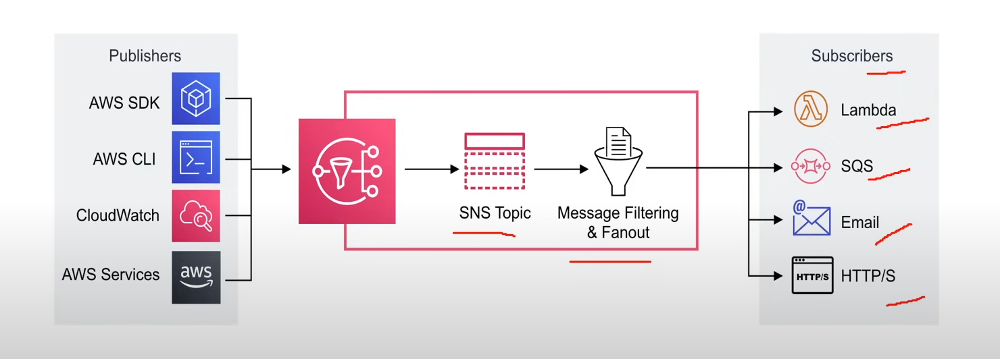

Amazon API Gateway: Fully managed service to create, publish, maintain, monitor and secure APIs. It acts as a bridge between your clients (mobile apps, browsers, IoT devices) and your backend (Lambda, EC2, DynamoDB, S3, etc). Automatically handles Authentication & Authorization(OAuth), Rate limiting & throttling(protect backend from overload), Caching, Monitoring(Cloudwatch integration), Auto scaling(Handles more requests). When client send a api request, it checks the resource '/product' and method 'GET' match the request and route it to perform specific operations on AWS services. Eg. /products fetches list of products from DynamoDB. API Gateway can transform raw DynamoDB/Lambda response into a clean JSON response

State Machine: A model which decides how one state moves to another based on conditions. Like a flow chart
AWS Step Functions: When you want multiple AWS services to execute in a serverless workflow one after another. Retry a step if there are any errors. Visualize each service as steps in the workflow
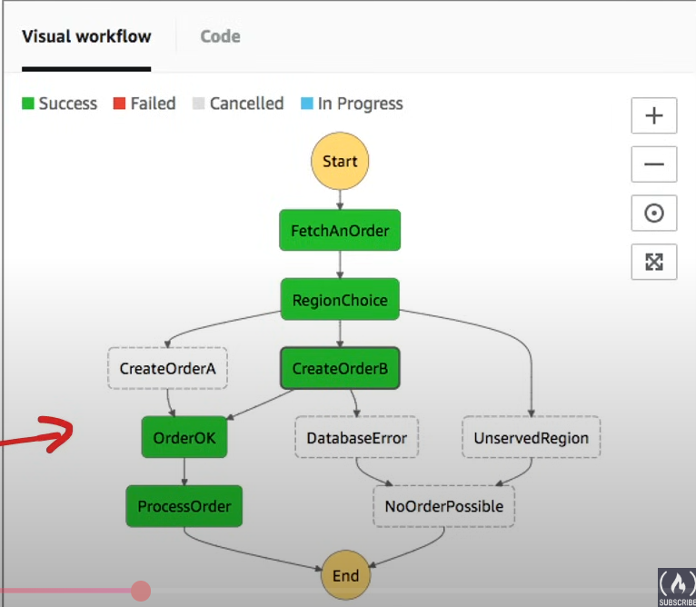

Event Bus: Similar to Streaming
AWS EventBridge(formerly CloudWatch Events): Serverless event bus service used for application integration by streaming real time data to applications
Every service already uses event bus(default event bus) Eg. Creating an EC2 instance places an event the event bus. Event bus is the one which holds the event data and rules(like a pipeline) to deliver to Consumers. Producer are creators of events like EC2, S3 etc. Consumers are the target of events. Events are JSON objects that travel in the event bus
There is also Custom Event Bus for custom rules and events(can also be scoped to work with multiple AWS accounts. Eg. event creation from another AWS account), there is Third Party Event Bus (SaaS vendors like shopify can integrate with EventBridge. Allows them to create event and place it on the event bus when a order happens)
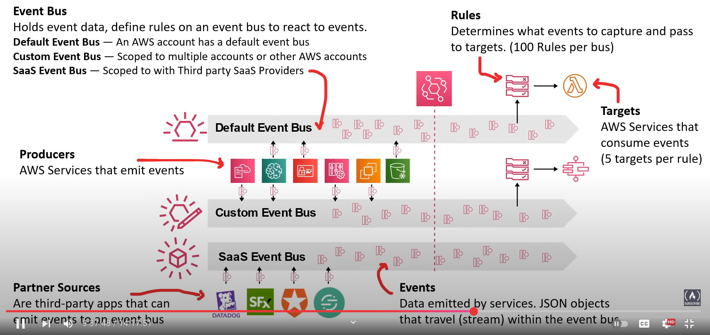

Amazon MQ: Managed message broker service that uses Apache ActiveMQ
Managed Kafka Service(MSK): Fully managed Apache Kafka Service. Open source streaming service
AppSync: Fully managed GraphQL service. Open source query adapter that allows you to query data from many different data sources

VMs vs Containers: Host OS use Hypervisor to run different softwares on one VM(all softwares share same space, you pay for whole VM even if you are not using some space(Eg. ECS with EC2 instance launch type)). Whereas, Host OS can use Docker daemon to run multiple softwares separately in containers(No conflict between softwares, in fargate you only pay for running the containers so you are not paying for space you dont need)(If containers do need space, they can scale up)(Eg. ECS with Fargate launch type)
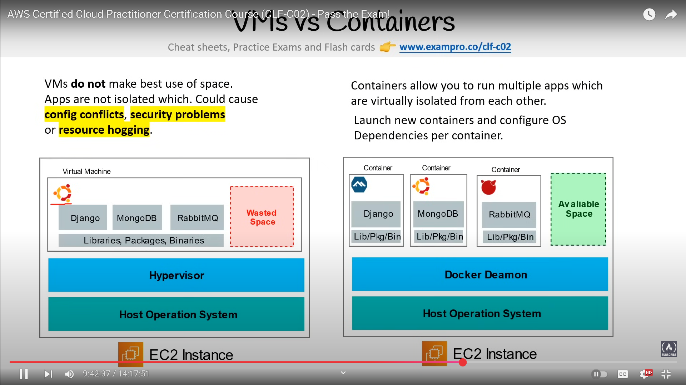

Monolithic(tightly coupled) vs Microservices Architecture(loosely coupled, functionality is isolated):
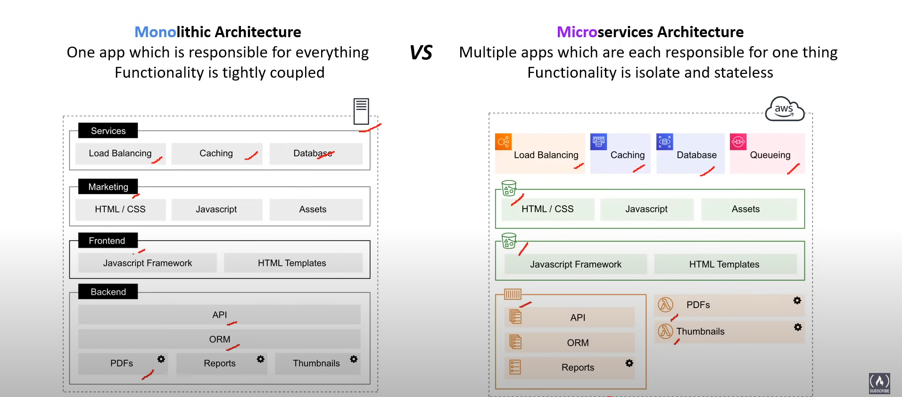

Kubernetes or K8: Open source container orchestration service(like ECS) for automating deployment, scaling and management of containers. Advantage of Kubernetes over Docker, is the ability to run containers across multiple VMs. Pods in Kubernetes are a group, with one or more containers sharing storage, network etc. Kubernetes is best for companies with microservice architecture to manage 'tens to hundreds' of services

Docker: Set of PaaS products, that use OS level virtualization to deliver software in packages called containers
Products are Docker CLI(cli commands to download, upload, build and run containers), Docker file(a config file on provisioning containers), Docker Compose(Config file when working with multiple containers), Docker Swarm(To manage multi container architectures), Dockerhub(Public repository)
Open Container Initiative(OCI): Standard for containers

Podman: OCI compliant Docker alternative. Can use poda like K8. Used alongside Buildah(tool to build OCI images), Skopeo(Tool for moving container images between different types of container storages(moving remote containers to local))

App Runner: PaaS specifically for containers
X-Ray: Analyze and debug between microservices(In microservices, many small services talking to each other so its hard to debug. You can trace and see how requests pass through each microservice and find where more time is spent)

AWS Organizations: Organiztional Units(OU)
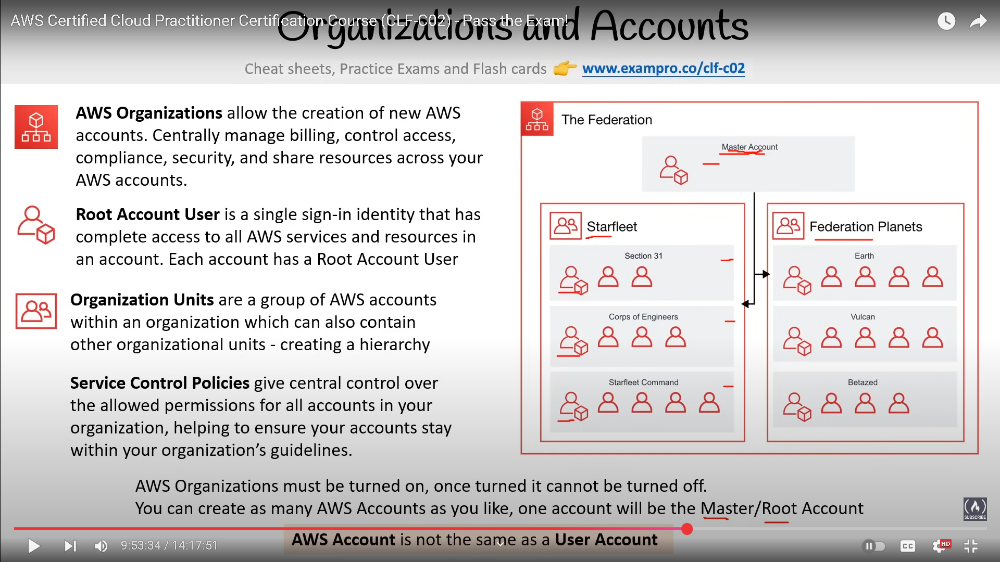

AWS Config: Compliance as Code framework to monitor, enforce and remediate changes. Tracks all resources in the region. Tracks changes(history of changes). Can use custom rules or conformance packs(premade compliance rules). Can also set remediation process(manual or auto)(can also set a lambda)

AWS QuickStarts: Prebuilt templates to deploy wide range of stacks like QnA bot. It is a Cloudformation template. Provides architecture diagram and guide about the architecture. Takes less than a hour to deploy

Tag: It is a key value pair that you can assign to aws resources. Eg. Name = MyS3Bucket

Resource Groups: Grouping resources with tags in organization. Can set tag policies to standardize tags in the organization

Business Centric Services:
Amazon Connect: Virtual call center service. Can create workflow(flow path) to route callers, record calls. Same system that AWS call centre uses
Workspaces: Virtual remote desktop service. Instead of sending hardware to employees to work from home, they can access it via cloud
WorkDocs: Shared collaboration service to share files and folders. Similar to SharePoint
Chime: Video conference service. Similar to Zoom. Can have multiple users on a call
WorkMail: Managed business email, contacts and calender service
Pinpoint: Marketing campaign management service. Used for sending targeted email via SMS, push notification, voice messages
Simple Email Service(SES): Transactional email service. Integrate with app to send emails
QuickSight: Business Intelligence(BI) service. Connect multiple data sources and quickly visualize date in the form of graphs with no programming knowledge

Provisioning Services: Provisioning means allocation or creation of resources to customers. AWS Provisioning Services are responsible for setting up and then managing those services
Elastic Beanstalk(EB, PaaS), AWS OpsWorks(configuration management service, also provides managed instances of open source configuration management software Chef and Puppet), CloudFormation(IaC, Infrastructure modelling and provisioning service), AWS QuickStarts(Cloudformation templates authorized by community or AWS), AWS Marketplace(Provision resource from marketplace), AWS Amplify(Mobile and web application framework, will provision multiple AWS services as backend), App Runner(quickly deploy containarized web application and APIs), AWS Copilot(CLI that allows to quickly launch and manage containerized app, CI/CD pipelines), AWS CodeStar(accelerates application delivery by providing a pre-configured continuous delivery toolchain), AWS Cloud Development Kit(IaC, same as CloudFormation but it allows to use several programming languages instead of JSON and YAML used in CloudFormation templates, generates CloudFormation template as result)

Elastic Beanstalk: Powered by CloudFormation templates. Eg. Create Ruby running on Linux with LB, Monitoring, Heath, Alarms etc. (Just upload code and deploy)

Serverless: When underlying servers, infrastructure and OS are managed by CSP. Pay for what you use, so cost effective. Scalable and highly available. Eg. DynamoDB, S3, ECS Fargate, AWS Lambda, Step Functions, Aurora Serverless(has cold start), SQS, SNS etc.

Windows on AWS: EC2: latest windows version is Windows Server 2019, SQL Server on RDS, AWS Directory Service(Microsoft Active Directory as a service), AWS Licence Manager(manage licenses from vendors), Amazon FSx(for Windows file server), AWS SDK(supports .NET), Amazon Workspaces(remote Windows Desktop), AWS Lambda(supports Powershell as a programming language), AWS Migration Acceleration Program(MAP)(for windows, to move large enterprises)

AWS License Manager: BYOL, the process of reusing an existing software license to run vendor's software on a cloud vendor's computing service. Can set vCPU, sockets etc that is allowed in license. Manager works with EC2 and RDS. For Microsoft windows server and Microsoft sql server license you generally need to use a Dedicated Host, because of Assurance program

Logging Services: CloudTrail(all API calls between AWS services), CloudWatch has many services underneath it like CloudWatch Logs(Used to view logs pushed to it), CloudWatch Metrics, EventBridge(trigger event based on condition like take snapshot og server every hour), CloudWatch Alarms(triggers alarms based on metrics), CloudWatch Dashboard(Visualalizations based on metrics), AWS X-Ray

AWS CloudTrail: 
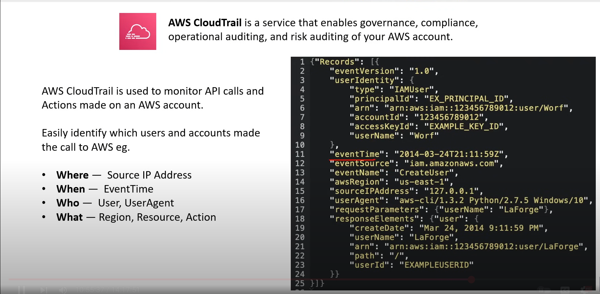
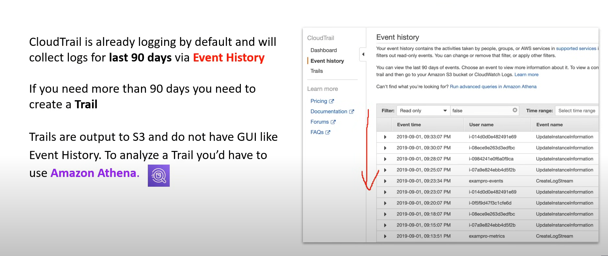
Event History stores last 90 days, more than that, you need to create a Trail and analyze it using Amazon Athena
Trails in CloudTrail: You can set to capture events you want(Management, Data, Insights) and store them in s3(can also send push it to CloudWatch Logs, then we can see logs real time and set Alarms, Metric Filters etc.)

CloudWatch Alarm:
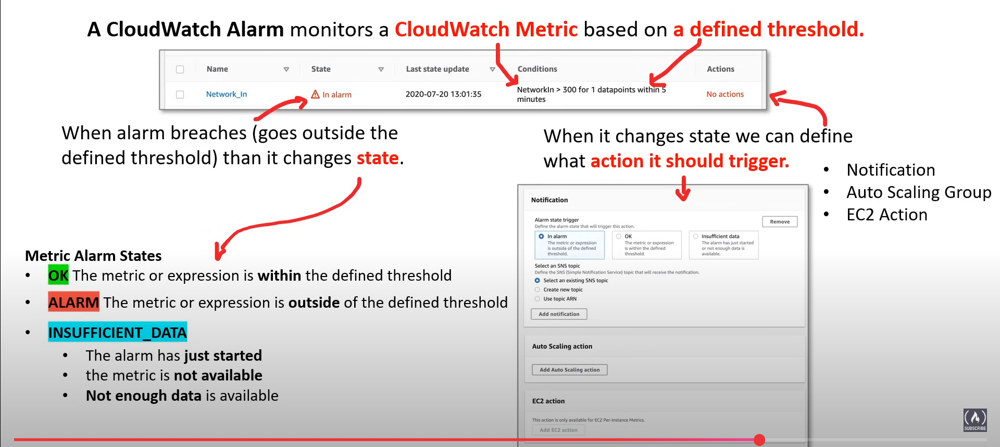
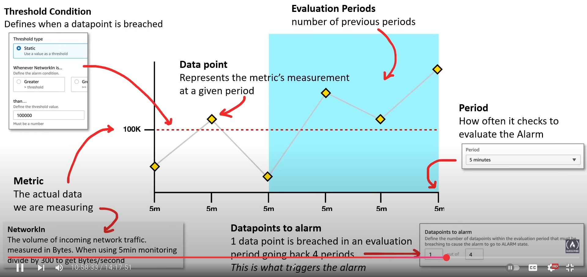
Alarm has Metric, Threshold Condition, Data point, Period, Period evaluation, Datapoints to alarm

CloudWatch Logs:
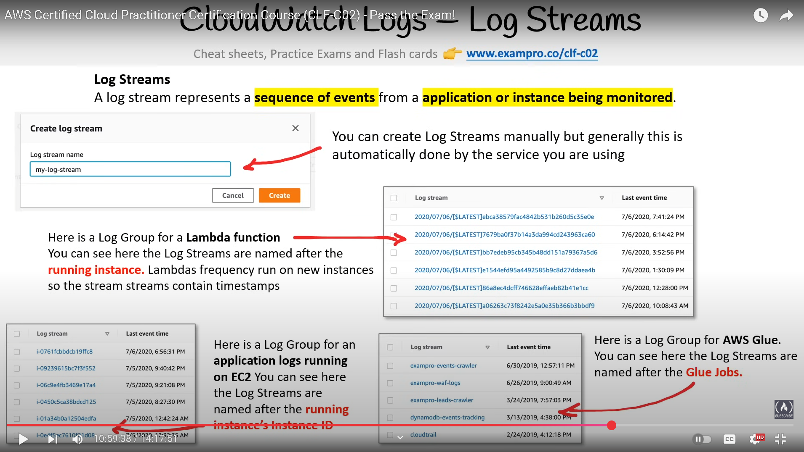

ML and AI services in AWS:
Amazon SageMaker, Amazon SageMaker Ground Truth(data labelling service, have humans label dataset)
Amazon Augmented AI: Implement human review of ML predictions

Machine Learning and AI Services:
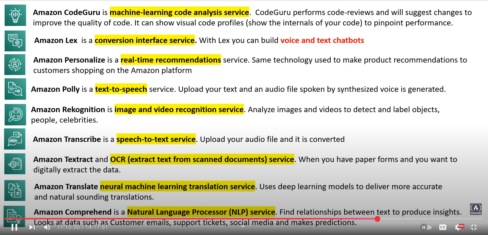
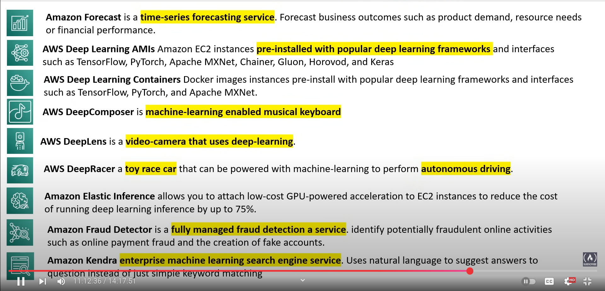
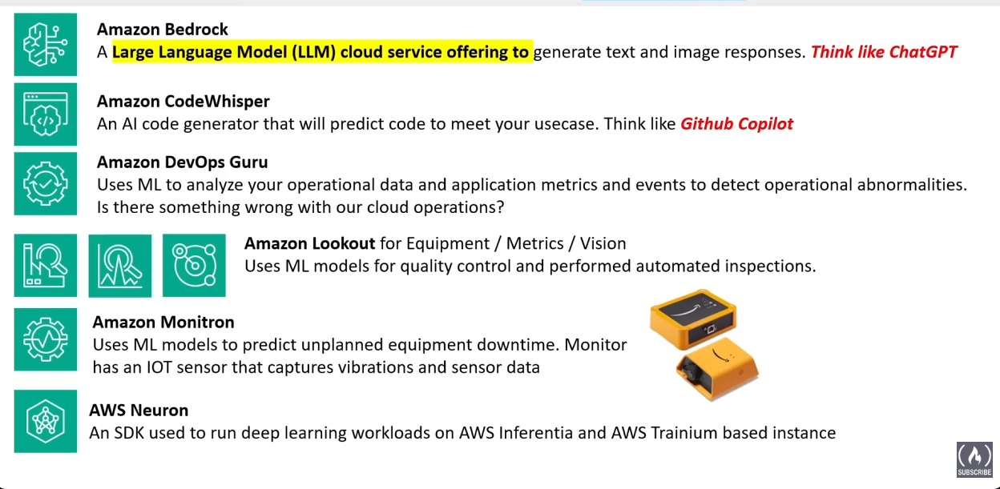

Big Data and Analytics Services:
Big data: massive volume of structured/unstructured data that is so large to move and process using traditional databases
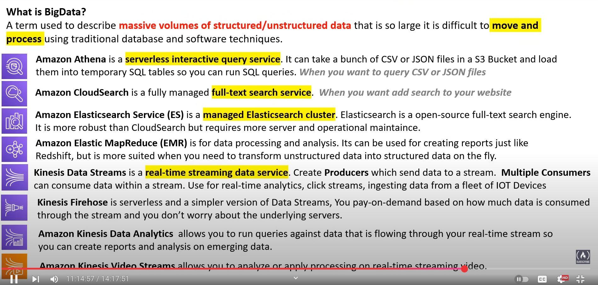
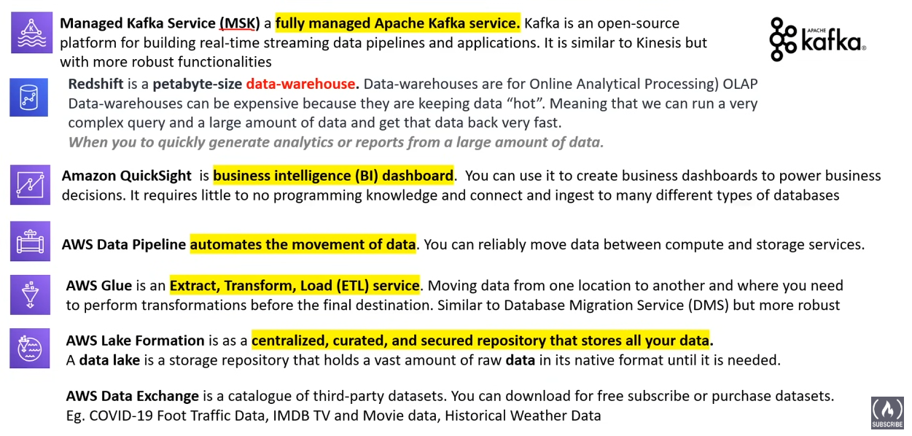

QuickSight: Uses SPICE(Superfast, Parallel, In-memory, Calculation Engine) to achieve blazing fast performance at scale. When you to import s3 data, excel(xlsx), csv etc, instead of querying the database each time to get insights, SPICE stores the data in-memory for faster results(Best for building dashboards like in PowerBI). QuickSight ML Insights: Forecasting, detect anomalies etc, QuickSight O: Ask questions using natural language on all your data and receive answer in seconds

Machine Learning Frameworks:
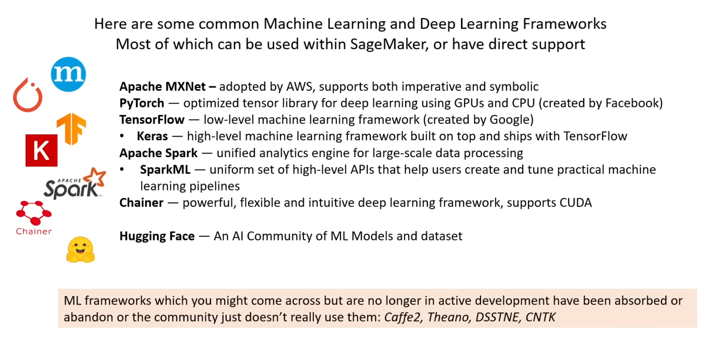

Intel Hardwares in AWS: Intel Xeon and Intel Habana Gaudi(AI training processor, competitor to NVIDIA)

AWS has lots of whitepapers, and Well Architected Framework is one of them
AWS Well Architected Framework: A whitepaper(guide/manual) to help customers build using best practices defined by AWS. There are 6 pillars
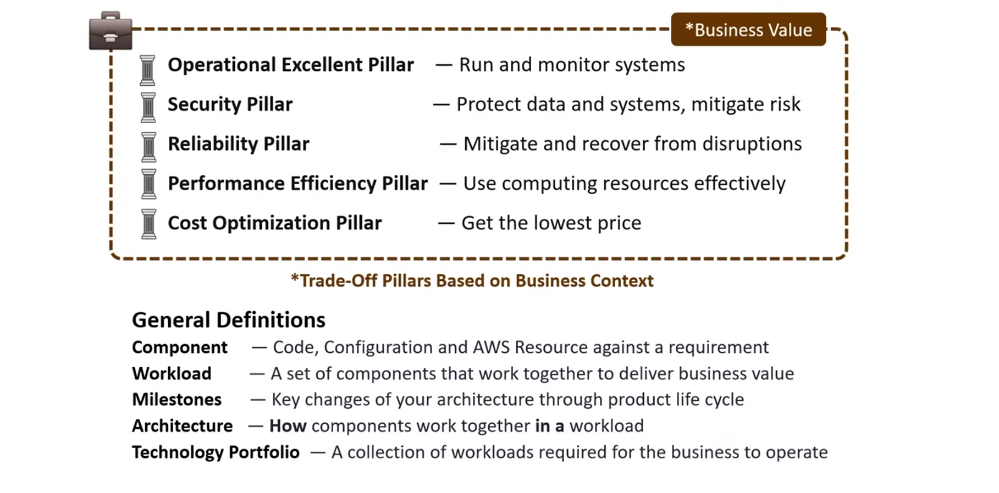
6th Pillar: Sustainability(reducing environmental impact, running serverless instead of always on EC2)
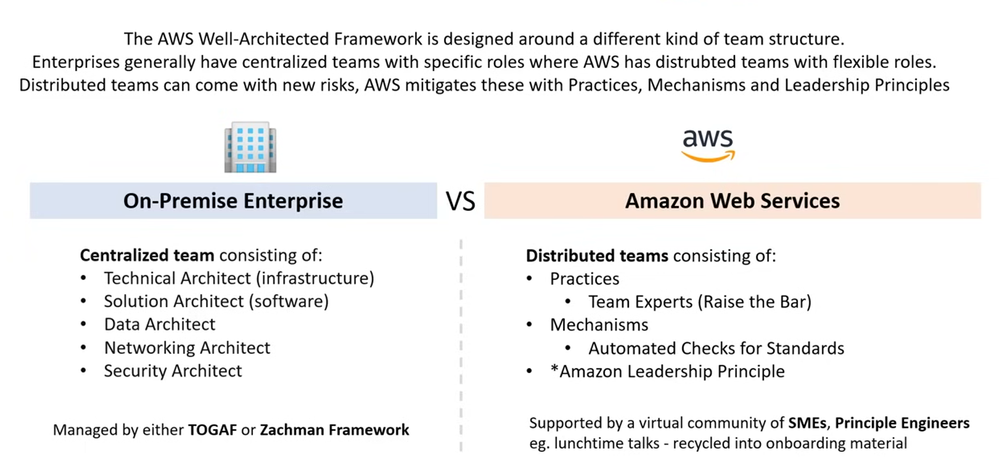
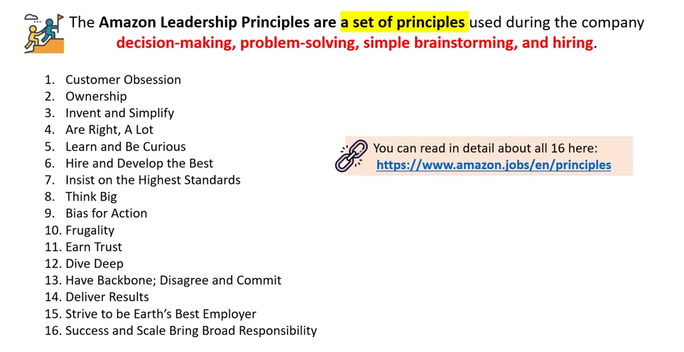
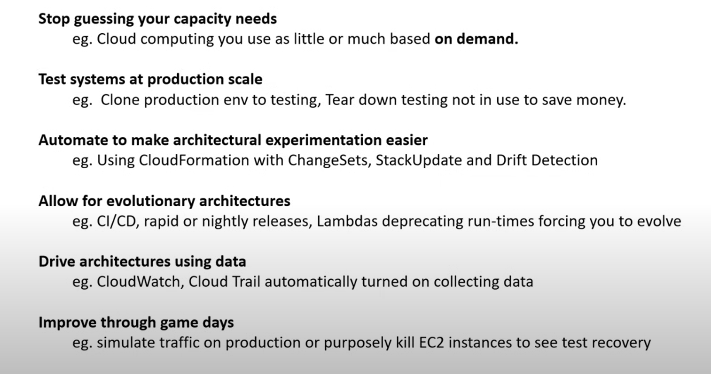
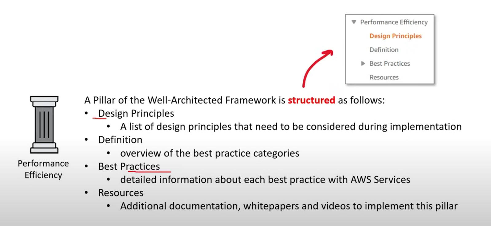

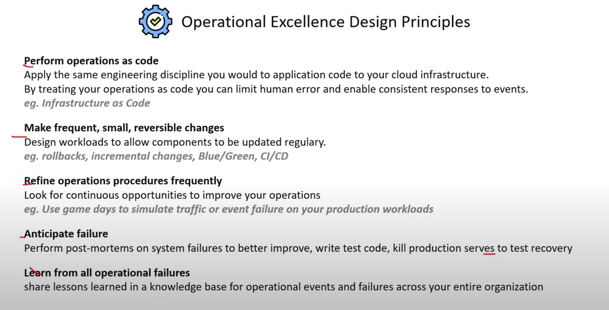
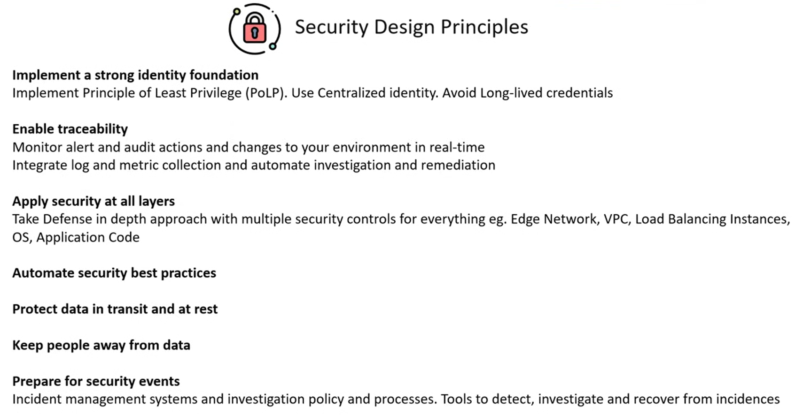
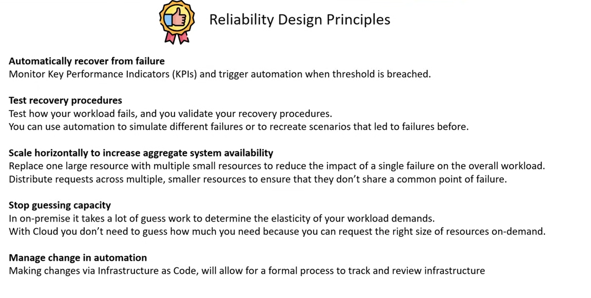
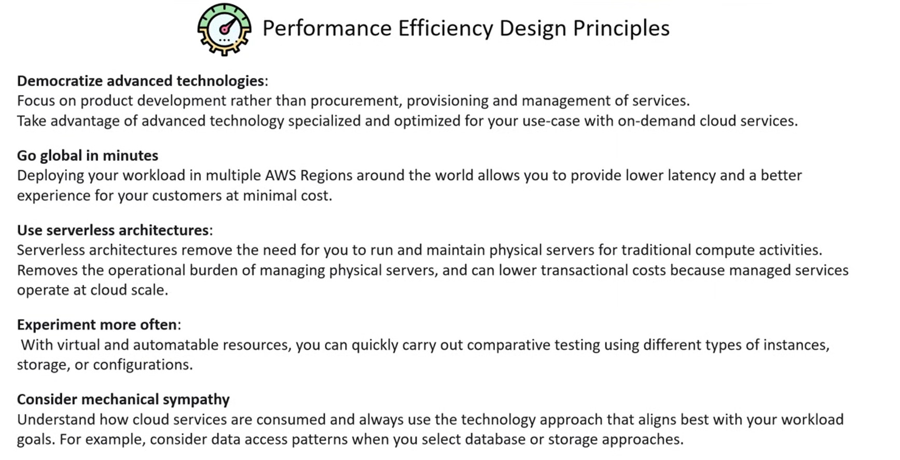


Well Architected Tool: Its an auditing tool to assess your cloud workload for alignment with the AWS Well Architected Framework. Its a checklist for best practices


TCO: Total Cost of Ownership(A financial estimate intented to determine the direct and indirect cost of a product or service). Eg. Direct and Indirect cost when moving from on-premise to cloud

Migration Cost Spikes but Operational Costs come down over time

Capital Expenditure(CAPEX): (On-premise) Spending money upfront on physical infrastructure. You can get tax breaks(Eg. if you buy server for 100rs and the life of the server is 5 years, then the annual depreciation is 20rs, i.e. 100/5 = 20, so you can file 20rs depreciated each year as expense(loss) and lower taxable income(profit))
Operational Expenditure(OPEX): (Cloud) Only need to spend operational cost of cloud like software licenses, cloud bills. Can try a product without investing in equipment


AWS Pricing Calculator: (/calculator.aws). No need to create an aws account. Can export final estimate to csv
Migration Evaluator: Evaluate cost of on-premise and compare it with cost of cloud. Uses an Agentless Collector(doesnt install any software on your server to collect information) to collect data from on-premise infrastructure to determine on-premise costs


Technical Account Manager(TAM): Provides guidance and support on everything about your AWS journey


Consolidated Billing: Its a feature of AWS Organizantions, which allows you to pay for multiple aws accounts with one bill. You can designate one master/root account that pays the charges of all other member accounts in the organization. Can use Cost Explorer in master account to visualize usage and billing. Can combine usage across all account to get volume pricing discounts


Service Level Agreement, Service Level Indicator, Service Level Objective:


AWS Abuse: When you get abused by AWS owned ip addresses.


AWS Partner Program(APN): Consulting Partner: you help companies utilize AWS, Technology Partner: you build technology ontop of AWS as a service offering. A partner belongs to a specific tier: select, advanced, premier

AWS Budget: Can setup alerts if you exceed or are approaching your defined budget. Create cost, usage or reservation budgets. Can be tracked at monthly, quarterly or yearly levels. 20k budget limit

AWS Budget Report: Used alongside AWS Budgets to create and send daily, weekly or monthly reports to specific emails

AWS Cost and Usage Reports (CUR): Generate detailed spreadsheet to better analyze and understand your AWS costs. Places reports into S3. Can use Athena to turn the report into queryable database. Can use Quicksight to visualize your billing data as graphs


